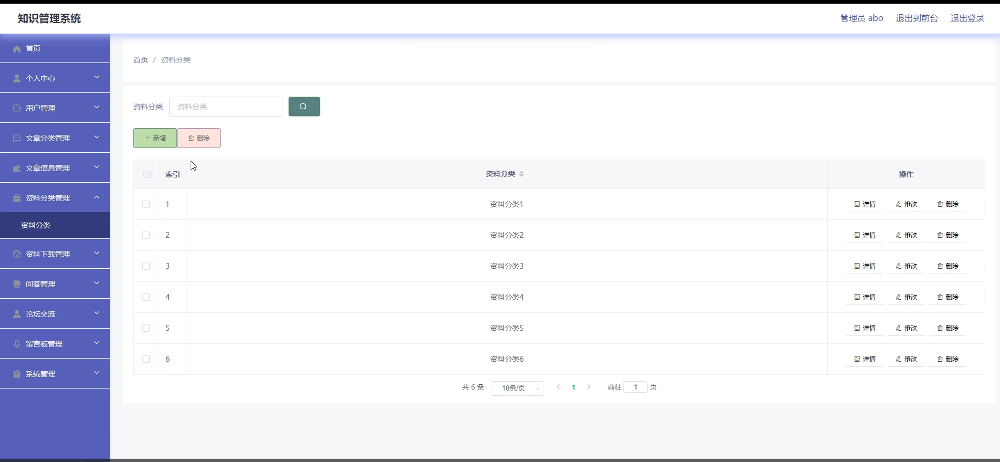
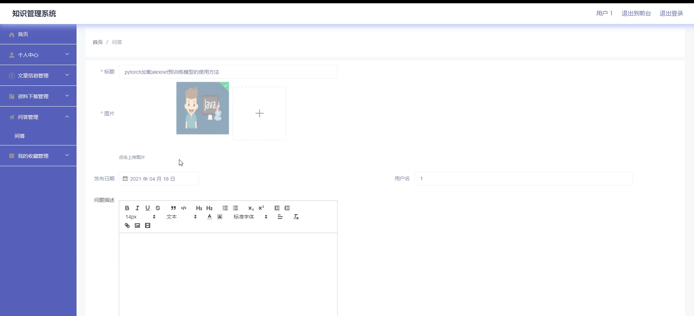

# 基于springboot的知识管理系统

---
### 👉作者QQ ：1556708905 微信：zheng0123Long (支持定制修改、部署调试、定制毕设)

### 👉接网站建设、小程序、H5、APP、各种系统等

---

#### 介绍

本知识管理系统基于 Spring Boot 框架精心打造。它以高效管理和便捷共享知识为核心目标，通过区分管理员和用户两种角色，提供了丰富且针对性强的功能。系统界面简洁直观，操作便捷，技术架构稳定可靠，能满足不同用户的需求，为知识管理领域带来创新和便利。

#### 技术栈

后端技术栈：Springboot+Mysql+Maven

前端技术栈：Vue+Html+Css+Javascript+ElementUI

开发工具：Idea+Vscode+Navicate

#### 系统功能介绍

1、管理员功能模块  

个人中心：管理员可以在此查看和修改个人的基本信息，如账号、密码、联系方式等，同时能够接收系统的重要通知和消息。  
用户管理：全面负责用户的注册审批、信息修改、权限分配以及账户的停用或删除等操作，确保用户信息的准确性和安全性。  
文章分类管理：对文章进行细致的分类定义，如技术类、学术类、生活类等，以便用户能够更快捷地找到所需文章。  
文章信息管理：涵盖文章的发布、编辑、删除以及审核等功能，保证文章内容的质量和合规性。  
资料分类管理：创建和维护资料的分类体系，如按照学科、行业、文件类型等进行分类，方便资料的组织和查找。  
资料下载管理：监控资料的下载情况，设置下载权限和限制，确保资料的合理使用和版权保护。  
问答管理：审核和处理用户提出的问题和回答，保证问答的有效性和专业性，促进知识的准确传播。  
论坛交流：监督论坛的交流内容，对于违规或不当的发言进行处理，维护良好的交流氛围。  
留言板管理：及时查看用户的留言，回复用户的咨询和建议，增强与用户的互动和沟通。  
系统管理：负责系统的参数设置、性能监控、数据备份与恢复等关键任务，保障系统的稳定运行和数据安全。  

2、用户功能模块  

文章信息：用户能够方便地浏览各类文章，获取所需的知识和信息，并可以对文章进行点赞、评论和分享。  
资料下载：根据自身需求搜索和下载相关资料，用于学习、研究或工作等用途。  
问答：用户可以提出自己的问题，也可以回答其他用户的问题，共同探讨和解决知识困惑。  
论坛交流：在论坛中与其他用户就特定主题展开深入的讨论和交流，分享经验和见解。  
留言反馈：当用户遇到问题或有改进建议时，可以通过留言板向管理员或平台反馈。  
个人中心：用户在此可以管理个人资料，包括修改昵称、头像、设置密码等，同时可以查看自己的浏览历史、下载记录和参与的问答、交流等活动记录。  
后台管理  
文章信息管理：用户可以对自己发布的文章进行编辑和删除操作。  
资料下载管理：查看自己的资料下载历史，管理已下载的资料。  
问答管理：跟踪自己参与的问答情况，对自己的回答进行修改和补充。  
我的收藏管理：管理收藏的文章、问答、资料等，方便快速找到重要的知识内容。  

#### 系统作用

1、对于管理员  
实现高效管理：通过集中且细化的管理功能，管理员能够有条不紊地组织和监督知识资源，确保系统的正常运行和内容的质量。  
优化资源配置：合理分类和管理文章、资料，根据用户需求和使用情况进行调整和优化，提高知识资源的利用效率。  
增强互动与服务：通过处理问答、留言和论坛交流，及时了解用户需求和反馈，提升用户满意度和忠诚度。  
保障系统安全与稳定：通过系统管理功能，定期备份数据，防范潜在风险，保障系统的持续稳定运行和数据的安全。  

2、对于用户  
便捷获取知识：用户能够快速找到自己所需的文章和资料，节省搜索时间，提高学习和工作效率。  
促进知识交流：通过问答、论坛交流等功能，与其他用户分享经验和见解，拓宽知识面，解决实际问题。  
个性化管理：用户可以在后台管理自己的知识活动，如收藏、发布的文章等，实现个性化的知识积累和整理。  
及时反馈与改进：通过留言反馈功能，向管理员提出建议和需求，促进系统的不断完善和优化，以更好地满足个人的知识管理需求。  

#### 系统功能截图

代码结构

数据库表

登录

文章分类管理

资料分类

系统管理

前台页面文章信息

个人中心

交流论坛

留言反馈

用户端后台管理

资源下载管理

问答管理

#### 总结

本知识管理系统凭借清晰的角色划分、丰富全面的功能模块，为管理员提供了强大的管理工具，为用户打造了便捷的知识获取与交流平台。它有助于知识的系统化整合、高效传播与创新应用，无论是对于个人的学习成长，还是对于团队和组织的知识沉淀与发展，都具有重要的意义和价值。随着技术的不断进步和用户需求的变化，该系统还将持续优化和升级，以保持其在知识管理领域的领先地位和实用性。

#### 使用说明

创建数据库，执行数据库脚本 修改jdbc数据库连接参数 下载安装maven依赖jar 启动idea中的springboot项目

后台地址：http://localhost:8080/springboot0w575/admin/dist/index.html

管理员  abo 密码 abo

前台地址：http://localhost:8080/springboot0w575/front/index.html

